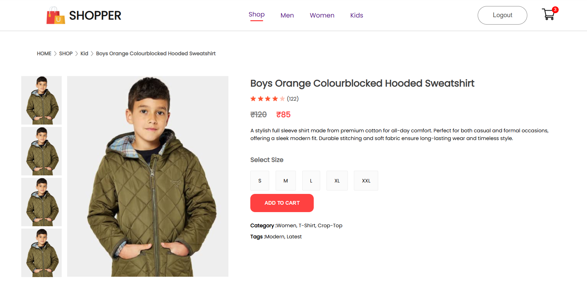
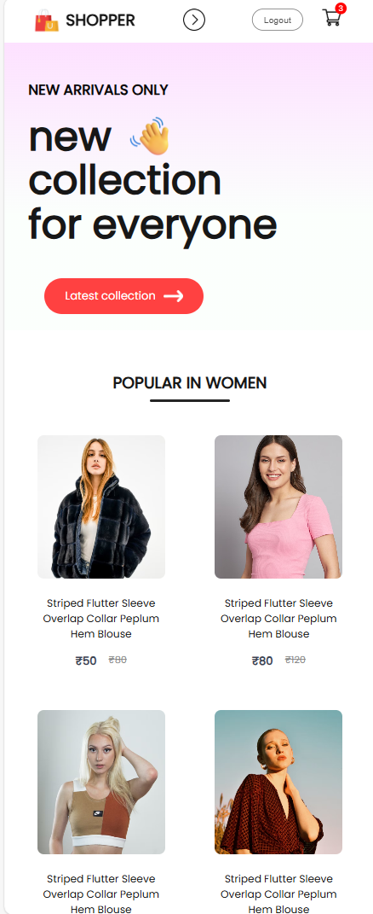
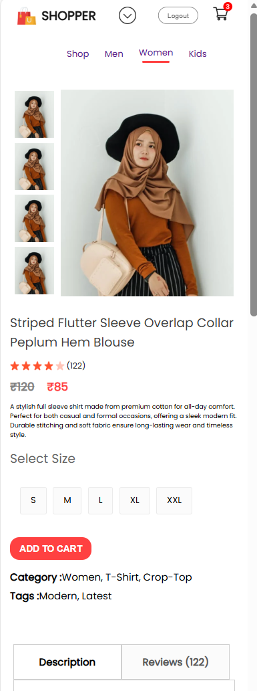

<h1 align="center">ShopNow – Full Stack E-Commerce Web Application</h1>

ShopNow is a full-stack e-commerce platform built using React, Node.js, Express, and MongoDB, offering a seamless shopping experience across all device sizes, including mobile phones, tablets, and laptops.The application includes a dedicated User Frontend for customers and an Admin Panel for managing products.

Users can browse products, view detailed item pages, manage their shopping cart, and authenticate securely using a JWT-based login system.Administrators can efficiently add, update, and remove products through a structured dashboard, ensuring complete control over the store’s inventory.

<h2>🚀 FEATURES</h2>

⭐ **User Frontend**

- Browse products
- View product details (images, description, price, category)
- Add to cart / remove from cart
- Products categories (Men, Women, Kids)
- New Collections section
- Popular in Women section
- Login / Signup with JWT
- Cart items persist after login
- Fully responsive UI

⭐ **Admin Dashboard**

- Add products (name, price, image, category)
- Remove products
- View product list
- Upload product images using Multer

⭐ **Backend API**

- Secure JWT authentication
- MongoDB product management
- User cart management
- Token-protected routes
- Persistent cart stored in MongoDB

<h2>🧰 Tech Stack</h2>

 * Frontend (User)

        React.js
        React Router
        Context API (Global state management)
        CSS

 * Admin Panel

        React + Vite
        Multer (Image uploads)
        
 * Backend

        Node.js
        Express.js
        MongoDB + Mongoose
        JWT Authentication
        Multer (image uploads)
        CORS enabled

<h2>📁 Folder Structure</h2>

```
ShopNow/
│
├── backend/
│   ├── index.js            # Main server file
│   ├── routes/             # API routes
│   ├── models/             # MongoDB models
│   ├── upload/
│   │   └── images/         # Uploaded product images
│
├── frontend/
│   ├── src/
│   ├── public/
│   └── package.json
│
├── admin/
│   ├── src/
│   ├── public/
│   └── package.json
│
└── README.md
```

<h2>⚙️ Environment Setup</h2>

* **Backend**
  
        cd backend
        npm install
        node index.js

    Server starts at:  http://localhost:4000

* **Frontend**

        cd frontend
        npm install
        npm start

    Runs at:  http://localhost:3000

* **Admin Panel**
  
        cd admin
        npm install
        npm run dev

    Runs at:  http://localhost:5173


<h2>🔑 Authentication</h2>

* Your app uses JWT tokens:
    - Token created on signup/login  
    - Sent in header as `auth-token`  
    - Used to validate protected routes:
        • `/addtocart`  
        • `/removefromcart`  
        • `/getcart`

<h2>📡 API Endpoints</h2>

* Product APIs
    | Method | Endpoint          | Description                     |
    |--------|-------------------|---------------------------------|
    | GET    | /allproducts      | Get all products                |
    | GET    | /newcollections   | Get last 8 products             |
    | GET    | /popularinwomen   | Get 4 women category products   |
    | POST   | /addproduct       | Add product (Admin)             |
    | POST   | /removeproduct    | Delete product (Admin)          |

* User Auth APIs
    | Method | Endpoint | Description               |
    |--------|----------|---------------------------|
    | POST   | /signup  | Register a new user       |
    | POST   | /login   | Login user and return JWT |

* Cart APIs
    | Method | Endpoint        | Protected | Description          |
    |--------|-----------------|-----------|----------------------|
    | POST   | /addtocart      | Yes       | Add item to cart     |
    | POST   | /removefromcart | Yes       | Remove item from cart|
    | POST   | /getcart        | Yes       | Load cart from DB    |

<h2>🖼 Screenshots</h2>

### 📌 Home Page


### 📌 Product Listing Page


### 📌 New Collections 


### 📌 Product Details Page


### 📌 Cart Page


### 📌 Login Page


### 📌 Signup Page


### 📌 Admin Dashboard (Add Product Page)


### 📌 Product List (Admin)


### 📌 Mobile and Tab (different sizes) View
     

<h2>🙌 Contributing</h2>

Pull requests are welcome!
For major changes, please open an issue to discuss what you'd like to change.

<h2>📜 License</h2>

This project is licensed under the MIT License.
